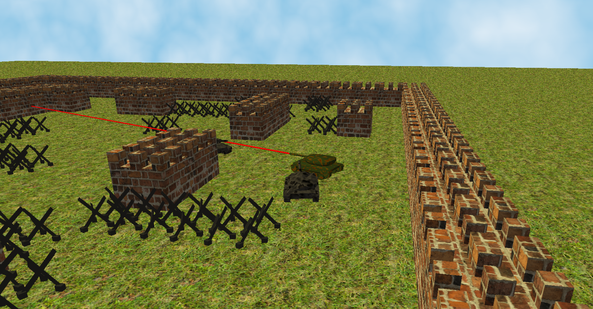

# Tank Survival
Tank Survival is a simple 3D arcade game. Four players on the same keyboard controlling tanks fight to be the only survivor left. Some parts of the terrain are destructible and bonuses spawn during the game.

This game was completely developed with C language by a group of four student from the french engineering school INSA de Rennes for a scholar project. It has to be fully coded in C language.

The game is based on a modulable game engine that contains different modules :
- 3D renderer (OpenGL) : Render UV-mapped textured models in the camera-relative 3D world. The renderer uses VBO indexing if the GPU support it. The engine can import .obj models and .bmp textures and is provided with a configurable light shader.
- Physics : The physic module can compute collisions between two rectangles in the same plane.
- Script : The script module allows to write the gameplay easily i.e. the conduct of the different displayed meshes.
- Audio (OpenAL) : With the audio module, .ogg audio files can be played. The module uses a queue-buffered reading to reduce RAM usage.

You can do whatever you want with that project.

Authors : Ethel Marquer, Maxime Peralta, Nicolas Kaczmarek and Gabriel Lucas from INSA Rennes, France
